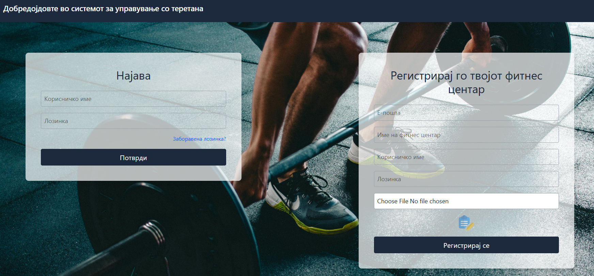
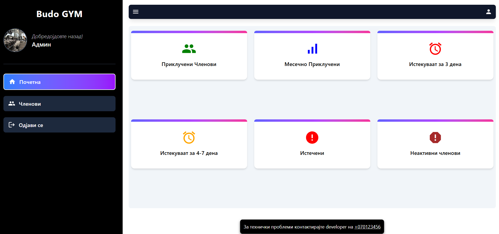
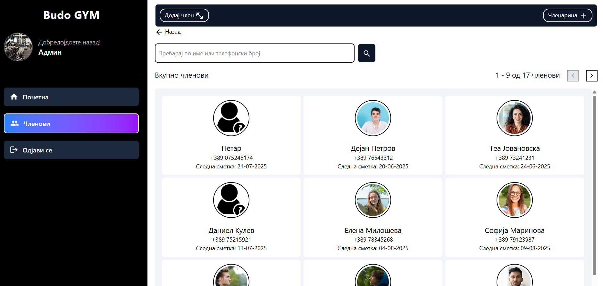
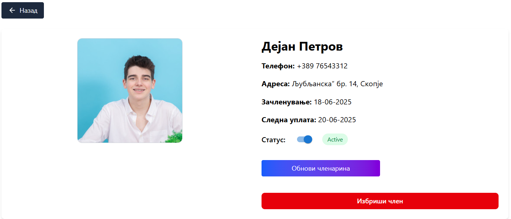

# 🏋️ Gym Management System (GMS)

A full-stack Gym Management System built with the **MERN** stack (MongoDB, Express.js, React.js, Node.js) and styled with Tailwind CSS.

---

## ⚙️ Tech Stack

- **Frontend:** React, React Router, Axios, Vite, Tailwind CSS
- **Backend:** Node.js, Express.js  
- **Database:** MongoDB (MongoDB Atlas for production)  
- **Authentication:** JWT + bcryptjs  
- **Validation & Middleware:** Express Validator *(optional)*, CORS  
- **API Documentation:** Swagger (`swagger-jsdoc` + `swagger-ui-express`)  
- **Deployment:** Docker, Docker Compose, [Vercel / Render / Netlify / Heroku]  

---

## 🧪 Features

- 👥 Member registration and login system  
- 🧑‍💼 Role-based access control: Guest, User, Admin  
- 📝 Add, edit, and search members & memberships  
- 📊 Dashboard with statistics and visual charts  
- 🔒 Secure JWT-based authentication  
- 📂 RESTful API with Swagger documentation  
- 🧹 `/db` endpoint for resetting or seeding the database *(dev only)*  

---

## 🖼️ Screenshots

### 🔐 Login Page


### 🧑‍💼 Admin Dashboard


### 📋 Member Management


### 📄 Member Details


---

## 🐳 Running Locally

Follow these steps to run the Gym Management System on your local machine using the MERN stack:

---

### 1. **Clone the repository**

```bash
git clone https://github.com/BlagojPetrov/GymManagementSystem.git
cd GymManagementSystem
```

---

### 2. **Install dependencies**

#### Backend (`gms-backend`)

```bash
cd gms-backend
npm install
```

#### Frontend (`gms-frontend`)

```bash
cd ../gms-frontend
npm install
```

---

### 3. **Set up environment variables**

#### In `gms-backend/.env`, create the following:

```env
PORT=4000
MONGO_URI=your_mongodb_connection_string
JWT_SECRET=your_jwt_secret
```

> Replace `your_mongodb_connection_string` with your MongoDB Atlas URI or local MongoDB connection, and `your_jwt_secret` with a random secure string.

---

#### In `gms-frontend/.env`, create the following:

```env
VITE_API_URL=http://localhost:4000/api
```

---

### 4. **Run the backend server**

```bash
cd gms-backend
npm start
```

- You should see:
  ```
  Server is running on port 4000
  DB connection successfully
  ```

---

### 5. **Run the frontend server**

```bash
cd ../gms-frontend
npm run dev
```

- You should see something like:

  ```
  VITE v6.3.5  ready in 624 ms

  ➜  Local:   http://localhost:5173/
  ➜  Network: use --host to expose
  ➜  press h + enter to show help
  ```

---

### 6. **Open the app**

Go to [http://localhost:5173](http://localhost:5173) in your browser to view the application.
